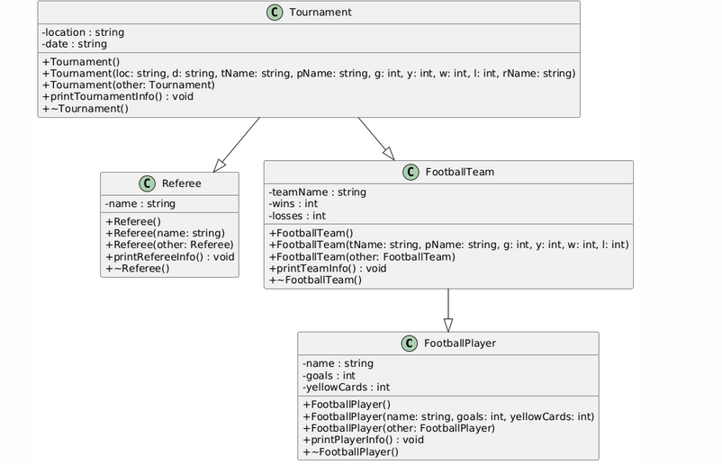

# Лабораторна робота №4: ООП

# Студента групи КІ2С-23-1 Рудичука Дмитра 
# Варіант завдання №4

## Тема
Наслідування. Множинне наслідування в С++

## Мета
- Вивчити основні принципи організації простого та множинного наслідування в С++
- Навчитися писати програми із застосуванням механізму наслідування


## Структура програми
Програма складається з трьох основних файлів:
- `main.cpp` — містить основну логіку програми.


### Функціонал
- Наслідування та множинне наслідування
- Методи для роботи з даними
- Конструктори та деструктори

# Діаграма


Файл із діаграмою знаходиться у директорії "images"

## Виконання програми
1. Клонувати репозиторій:
   ```bash
   git clone https://github.com/RudychukDmytro/OOP_Labs_4
2. Перейти відкрити в термінальному вікні робочий каталог
3. Виконати компіляцію:
   ```bash
   g++ main.cpp students.cpp trains.cpp -o program
4. Запустити скомпільований файл:
   ```bash
   ./program

Приклад для запуску програми наведено для операційної системи Ubuntu або їй подібним.

## Висновки

У ході виконання лабораторної роботи ми реалізували ієрархію класів для симуляції футбольного турніру з використанням наслідування та множинного наслідування в C++. Було розроблено чотири класи: FootballPlayer, Referee, FootballTeam, та Tournament, які демонструють основні принципи об'єктно-орієнтованого програмування.

Основні досягнення:

1. Наслідування та множинне наслідування: Ми створили клас FootballTeam, що наслідує від класу FootballPlayer, та клас Tournament, що наслідує одночасно від двох базових класів — FootballTeam і Referee. Це дозволило ефективно використовувати можливості об'єктно-орієнтованого підходу для організації даних та логіки.

2. Конструктори та деструктори: У кожному класі було реалізовано кілька видів конструкторів (без параметрів, з параметрами, копіювальний) для забезпечення різних варіантів ініціалізації об'єктів. Деструктори були включені для вивільнення ресурсів і демонстрації життєвого циклу об'єктів.

3. Методи для роботи з даними: Кожен клас мав методи для зчитування і виведення інформації про відповідні об'єкти. Це дозволило користувачеві отримати повну інформацію про стан кожного об'єкта, включаючи футболістів, суддів, команди та турніри.

Таким чином, лабораторна робота дозволила закріпити знання з теми наслідування в C++, особливо множинного наслідування, та розвинути практичні навички у створенні та взаємодії об'єктів у межах ієрархії класів.
